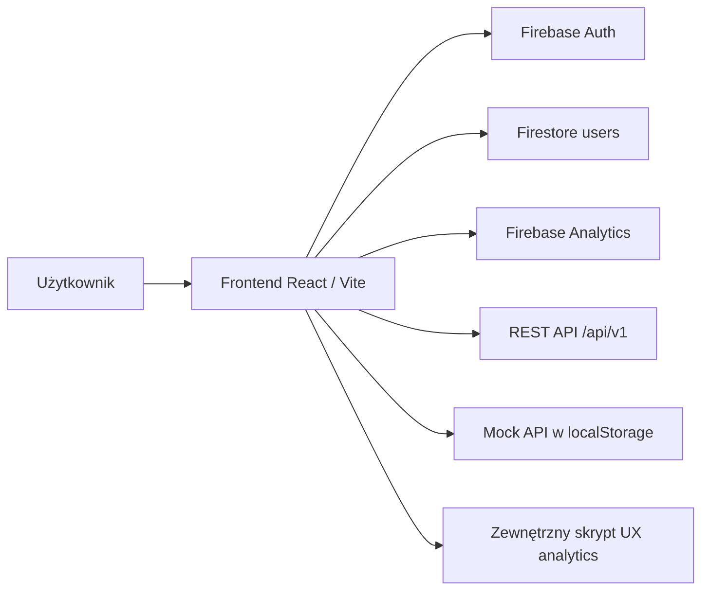

# BasiaKasiaAsia

Frontendowa aplikacja forum społecznościowego zbudowana w React i TypeScript, oparta o Firebase Authentication, Firestore oraz Firebase Analytics. Repozytorium zawiera także prostą infrastrukturę Terraform do publikacji frontendu w Azure App Service.

Projekt działa jako SPA i obsługuje dwa główne obszary:
- część publiczną: strona główna, logowanie/rejestracja, opis społeczności,
- część aplikacyjną: fora, wątki, komentarze, profil użytkownika, panel administracyjny.

## Najważniejsze funkcje

- logowanie e-mailem i hasłem przez Firebase Auth,
- logowanie przez Google (`signInWithPopup`),
- role użytkowników `user` i `admin`,
- ochrona tras `/profile` i `/admin`,
- lista forów z filtrowaniem,
- tworzenie nowych forów przez administratora,
- lista wątków w ramach forum z filtrowaniem,
- tworzenie nowych wątków,
- podgląd szczegółów wątku i dodawanie komentarzy,
- panel administratora do przeglądu użytkowników i forów,
- ban / unban użytkowników,
- dodawanie nowych administratorów,
- powiadomienia zapisane lokalnie po akcjach takich jak utworzenie forum, wątku, komentarza lub moderacja,
- śledzenie odsłon ekranów przez Firebase Analytics,
- tryb mock dla warstwy danych forum i administracji.

## Stack technologiczny

| Obszar | Technologia | Zastosowanie |
| --- | --- | --- |
| Frontend | React 19, TypeScript, Vite | aplikacja SPA |
| Routing | `react-router-dom` | trasy publiczne i chronione |
| UI | Tailwind CSS v4, shadcn/ui, Radix UI | komponenty interfejsu |
| Tabele | TanStack Table | widoki admina i forum |
| Edytor | Lexical | podpis użytkownika w profilu |
| Powiadomienia | Sonner | toasty i feedback w UI |
| Integracja HTTP | Axios | komunikacja z backendem REST |
| Auth | Firebase Authentication | logowanie e-mail/hasło i Google |
| Dane profilu / ról | Firestore | kolekcja `users` |
| Analytics | Firebase Analytics | `page_view` i zdarzenia niestandardowe |
| UX analytics | zewnętrzny skrypt w `frontend/index.html` | obecnie osadzony jest skrypt Contentsquare |
| Deployment | Terraform + Azure App Service | publikacja buildu frontendu |

## Architektura



### Jak to działa w praktyce

- `AuthProvider` nasłuchuje zmian sesji Firebase i buduje stan aplikacji.
- Rola użytkownika jest odczytywana z dokumentu `users/{uid}` w Firestore.
- Axios automatycznie dokleja token Firebase ID do nagłówka `Authorization: Bearer ...`.
- Dane forum, wątków, komentarzy, użytkowników i części profilu mogą być pobierane z backendu REST albo z lokalnego mocka, zależnie od `VITE_USE_MOCK_API`.
- Odsłony stron są logowane w `ScreenTracker` przy każdej zmianie trasy.

## Role i trasy

| Trasa | Dostęp | Opis |
| --- | --- | --- |
| `/` | publiczny | landing page projektu |
| `/login` | publiczny | logowanie i rejestracja |
| `/about` | publiczny | opis społeczności i założycielek |
| `/forum` | publiczny | lista forów |
| `/forum/:id` | publiczny | lista wątków w forum |
| `/forum/:id/thread/:threadId` | publiczny | szczegóły wątku i komentarze |
| `/profile` | zalogowany użytkownik | profil użytkownika |
| `/admin` | administrator | panel zarządzania użytkownikami i forami |

## Struktura repozytorium

```text
.
|-- README.md
|-- frontend/
|   |-- src/
|   |   |-- components/     # komponenty UI i widoki tabel
|   |   |-- config/         # konfiguracja API, Firebase i storage
|   |   |-- hooks/          # auth i powiadomienia
|   |   |-- mocks/          # lokalny mock API
|   |   |-- pages/          # strony aplikacji
|   |   `-- services/       # warstwa integracji i logika dostępu do danych
|   |-- docs/               # materiały domenowe i badania preferencji
|   `-- package.json
`-- azure/
    |-- main.tf             # App Service + Service Plan + zip deploy
    |-- variables.tf
    |-- outputs.tf
    `-- update-app.sh
```

## Wymagania

- Node.js 20+,
- npm 10+,
- konto Firebase z włączonym Authentication, Firestore i Analytics,
- opcjonalnie Terraform 1.7+ i konto Azure do deploymentu,
- opcjonalnie Nix, jeśli chcesz korzystać z przygotowanych `flake.nix`.

## Uruchomienie lokalne

### 1. Instalacja zależności

```bash
cd frontend
npm install
```

Jeżeli chcesz pełną zgodność z `package-lock.json`, użyj:

```bash
npm ci
```

### 2. Konfiguracja środowiska

Skopiuj plik przykładowy:

```bash
cp .env.example .env
```

Uzupełnij dane Firebase i adres backendu.

### 3. Start aplikacji

```bash
npm run dev
```

Domyślnie Vite uruchomi aplikację lokalnie i wystawi ją pod adresem developerskim, np. `http://localhost:5173`.

### 4. Dodatkowe komendy

```bash
npm run build
npm run preview
npm run lint
```

## Zmienne środowiskowe

Plik wzorcowy znajduje się w `frontend/.env.example`.

| Zmienna | Opis |
| --- | --- |
| `VITE_USE_MOCK_API` | przełącza dane forum i administracji na lokalny mock |
| `VITE_API_ROOT_URL` | bazowy adres backendu, domyślnie `http://localhost:8000` |
| `VITE_FIREBASE_API_KEY` | konfiguracja Firebase |
| `VITE_FIREBASE_AUTH_DOMAIN` | domena projektu Firebase |
| `VITE_FIREBASE_PROJECT_ID` | identyfikator projektu Firebase |
| `VITE_FIREBASE_STORAGE_BUCKET` | bucket Storage |
| `VITE_FIREBASE_MESSAGING_SENDER_ID` | identyfikator nadawcy |
| `VITE_FIREBASE_APP_ID` | identyfikator aplikacji |
| `VITE_FIREBASE_MEASUREMENT_ID` | identyfikator Analytics |

## Tryb mock

Tryb mock pozwala uruchomić forum i panel administracyjny bez działającego backendu REST.

### Co jest mockowane

- fora,
- wątki,
- komentarze,
- lista użytkowników,
- ban / unban,
- część danych profilu,
- lokalne powiadomienia.

### Jak włączyć

W `frontend/.env` ustaw:

```env
VITE_USE_MOCK_API=true
```

### Ważne ograniczenie

Tryb mock nie zastępuje warstwy uwierzytelniania Firebase. Logowanie i rejestracja nadal korzystają z Firebase Auth, a rola użytkownika nadal zależy od danych w Firestore lub od użytkownika mapowanego do mocka. Innymi słowy: mock odciąża backend forum, ale nie eliminuje potrzeby poprawnej konfiguracji Firebase.

### Dane lokalne

Mock zapisuje stan w przeglądarce:

- `frontend-mock-db-v1`,
- `frontend-mock-user`,
- `frontend-notifications-v1`.

## Integracja z Firebase

Projekt korzysta z trzech głównych usług Firebase:

### 1. Authentication

- logowanie e-mail/hasło,
- rejestracja nowych użytkowników,
- logowanie Google,
- nasłuch stanu sesji po stronie klienta.

### 2. Firestore

Kolekcja `users` przechowuje minimalny profil użytkownika:

- `uid`,
- `email`,
- `username`,
- `role`,
- `createdAt`.

Rola `admin` odblokowuje panel administracyjny i akcje moderacyjne.

### 3. Analytics

Aplikacja loguje odsłony ekranów i może wysyłać własne zdarzenia przez `src/services/analytics.ts`.

## Backend i kontrakt API

Repozytorium nie zawiera backendu. Frontend zakłada, że istnieje serwer REST pod `VITE_API_ROOT_URL`, a właściwe endpointy są dostępne pod `/api/v1`.

Przykładowe wykorzystywane endpointy:

- `GET /forums`
- `GET /forums/:id`
- `GET /forums/:id/threads`
- `POST /forums`
- `POST /threads`
- `GET /threads/:id`
- `GET /threads/:id/comments`
- `POST /comments`
- `GET /users`
- `POST /users/:id/ban`
- `POST /users/:id/unban`

Każde żądanie może otrzymać token Firebase w nagłówku `Authorization`.
