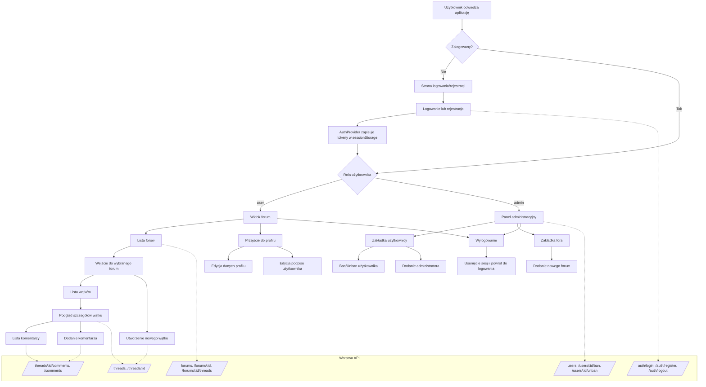

# Domena tematyczna i badanie preferencji użytkownika

## 1. Kontekst produktu (na bazie analizy kodu)
Aplikacja to forum społecznościowe z rolami `user` i `admin`, z przepływem: rejestracja/logowanie -> wybór forum -> wątki -> komentarze.

Wnioski z implementacji:
- Jest gotowy obszar tematyczny forum i opisy misji społeczności (strona About).
- Użytkownicy mogą tworzyć fora (admin), zakładać wątki i dodawać komentarze.
- Istnieje panel administracyjny do zarządzania użytkownikami i forami (w tym ban/unban).
- Profil użytkownika jest obecnie głównie demonstracyjny (dane typu dummy), ale ma potencjał do personalizacji.

## 2. Proponowana domena tematyczna produktu
### Nazwa domeny
**Społeczność kobiet: codzienność, wsparcie i rozwój osobisty**

### Cel domeny
Stworzenie bezpiecznej przestrzeni, w której użytkowniczki wymieniają wiedzę praktyczną i doświadczenia w codziennych obszarach życia.

### Główne filary tematyczne
1. Codzienność i organizacja życia
2. Dom i porządek
3. Kuchnia i przepisy
4. Moda i styl
5. DIY / rękodzieło
6. Relacje i wellbeing (proponowane rozszerzenie)
7. Kariera i finanse osobiste (proponowane rozszerzenie)

### Struktura taksonomii (MVP)
- Poziom 1: Kategoria (np. "Kuchnia i przepisy")
- Poziom 2: Podkategoria (np. "Szybkie obiady", "Tradycyjne przepisy")
- Poziom 3: Tag (np. "15 minut", "wegetariańskie", "budżetowe")

Ta struktura pozwoli lepiej dopasowywać treści i przyszłe rekomendacje.

## 3. Model preferencji użytkownika
### Co rozumiemy przez "preferencje"
Preferencje to obserwowalne sygnały zainteresowania użytkownika tematami, formatem treści oraz stylem interakcji.

### Wymiary preferencji
1. Preferencje tematyczne: które kategorie i tagi użytkownik wybiera najczęściej.
2. Preferencje formatu: krótkie porady, dłuższe historie, checklisty, pytania-odpowiedzi.
3. Preferencje interakcji: tworzenie nowych wątków vs komentowanie vs bierne czytanie.
4. Preferencje czasowe: pory aktywności i częstotliwość powrotów.
5. Preferencje społecznościowe: poziom otwartości na kontakt i wsparcie innych.

### Dane do zbierania (bezpieczne i minimalne)
- Wejścia na kategorie i wątki.
- Czas czytania wątku (przybliżony).
- Liczba utworzonych wątków i komentarzy per kategoria.
- Akcje administracyjne jako sygnał jakości społeczności (ban/unban, moderacja).
- Deklaratywne zainteresowania z krótkiej ankiety onboardingowej.

## 4. Badanie preferencji użytkownika (plan)
### Cel badania
Zrozumieć, jakie tematy i formaty treści zwiększają:
- retencję użytkowniczek,
- aktywność (wątki/komentarze),
- poczucie wartości społeczności.

### Hipotezy badawcze
1. Największe zaangażowanie generują treści praktyczne (checklisty, konkretne porady).
2. Użytkowniczki wracają częściej, gdy widzą treści z preferowanych 2-3 kategorii.
3. Nowe użytkowniczki szybciej aktywują się, jeśli onboarding zapyta o zainteresowania i od razu pokaże dopasowane fora.

### Metodyka (mixed-method)
1. Badanie ilościowe (2-4 tygodnie)
- Zdarzenia produktowe: wejście do forum, wejście do wątku, utworzenie wątku, komentarz.
- Segmenty: nowa vs powracająca użytkowniczka, aktywna vs pasywna.
- Wyniki: CTR kategorii, współczynnik komentarzy na wątek, D1/D7 retention.

2. Badanie jakościowe (6-10 wywiadów)
- Półustrukturyzowane rozmowy z użytkowniczkami.
- Tematy: motywacja wejścia, poczucie bezpieczeństwa, trudności, oczekiwane funkcje.
- Wyniki: mapa potrzeb, bariery aktywności, język komunikacji marki.

3. Ankieta in-app (krótka, 5 pytań)
- Pytania o 3 ulubione obszary tematyczne.
- Preferowany format treści.
- Gotowość do publikowania własnych postów.

## 5. Proponowane pytania badawcze
Poniżej znajduje się krótka ankieta z pytaniami zamkniętymi, którą można wykorzystać w onboardingu lub badaniu in-app.

1. Jak często korzystasz z forum?
	- Codziennie
	- Kilka razy w tygodniu
	- Raz w tygodniu
	- Rzadziej

2. Co robisz najczęściej podczas korzystania z forum?
	- Czytam wątki
	- Komentuję
	- Tworzę nowe wątki
	- Tylko przeglądam

3. Które tematy interesują Cię najbardziej?
	- Codzienność i organizacja życia
	- Dom i porządek
	- Kuchnia i przepisy
	- Moda i styl
	- DIY / rękodzieło
	- Relacje i wellbeing
	- Kariera i finanse osobiste
    - Inne

4. Jaki format treści preferujesz?
	- Krótkie porady
	- Dłuższe historie
	- Checklisty
	- Pytania i odpowiedzi
	- Poradniki krok po kroku

5. Co najbardziej zachęca Cię do napisania komentarza?
	- Konkretna i użyteczna treść
	- Podobne doświadczenie autora
	- Chęć podzielenia się opinią
	- Szybka możliwość odpowiedzi
	- Rzadko komentuję

6. Jak oceniasz poczucie bezpieczeństwa w społeczności?
	- Bardzo dobrze
	- Raczej dobrze
	- Neutralnie
	- Raczej źle
	- Bardzo źle

7. Co najbardziej utrudnia Ci korzystanie z forum?
	- Za mało interesujących tematów
	- Zbyt duży chaos w treściach
	- Mała aktywność innych użytkowników
	- Trudna nawigacja
	- Nic mi nie przeszkadza

8. Czy chcesz widzieć treści dopasowane do Twoich zainteresowań?
	- Tak, zdecydowanie
	- Raczej tak
	- Raczej nie
	- Nie

9. Jakie powiadomienia są dla Ciebie najbardziej przydatne?
	- O odpowiedziach do moich wpisów
	- O nowych wątkach w ulubionych kategoriach
	- O obu powyższych
	- Nie chcę powiadomień

10. Czy był(a)byś skłonna/skłonny założyć własny wątek w ciągu najbliższego miesiąca?
	- Tak
	- Raczej tak
	- Raczej nie
	- Nie

## 6. KPI do monitorowania po wdrożeniu
1. `Forum Engagement Rate` = (użytkowniczki z min. 1 akcją / wszystkie zalogowane) tygodniowo.
2. `Content Interaction Depth` = średnia liczba interakcji na sesję.
3. `Creator Ratio` = odsetek użytkowniczek, które utworzyły min. 1 wątek w 30 dni.
4. `D7 Retention` dla nowych rejestracji.
5. `Healthy Community Score` = komentarze konstruktywne / wszystkie komentarze + niski poziom sankcji.

## 7. Backlog wdrożeniowy (krótki)
1. Dodać onboarding z wyborem zainteresowań (3-5 kategorii).
2. Rozszerzyć model forum/wątków o tagi.
3. Dodać podstawowy tracking zdarzeń produktowych.
4. Uzupełnić profil o prawdziwe dane użytkownika (zamiast dummy).
5. Dodać sekcję "Polecane dla Ciebie" na podstawie ostatnich interakcji.

## 8. Efekt biznesowy
Po wdrożeniu tej domeny i badania preferencji produkt powinien szybciej osiągać:
- lepsze dopasowanie treści,
- wyższą retencję,
- większą aktywność społeczności,
- bardziej przewidywalny rozwój funkcji oparty o dane.

## 9. Diagram funkcjonalności (Mermaid)

